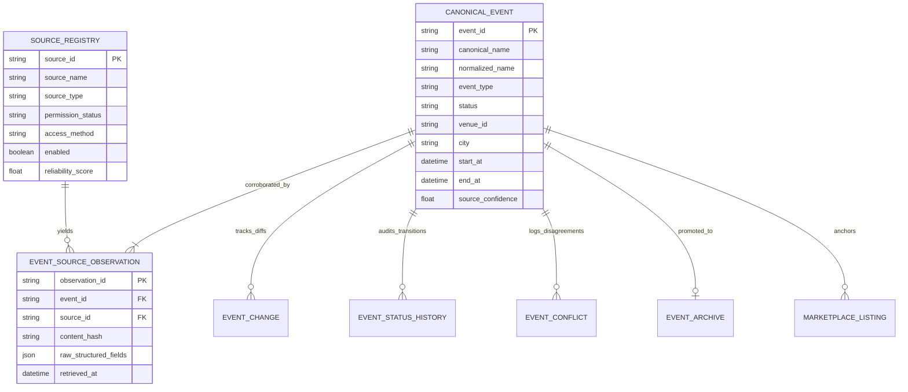

# TIKUM — EVENT DATA MODEL SPECIFICATION
**Data Architecture & Schema Reference**  
**Version:** 1.0.0  
**Compliance Authority:** SHINERVA HQ Core Infrastructure

---

## 1. Entity-Relationship Overview

---

## 2. Core Entities & Complete Schema Definitions

### 2.1 Canonical Event (`canonical_events`)
The primary single source of truth for every verified event across Indonesia.

| Field Name | Type | Required | Description | Example |
| :--- | :--- | :--- | :--- | :--- |
| `event_id` | `String` (UUID) | Yes | Canonical immutable primary identifier | `"ev-can-8f2a1b9c"` |
| `id` | `String` | Yes | Alias for marketplace compatibility | `"ev-can-8f2a1b9c"` |
| `canonical_name` | `String` | Yes | Cleaned, normalized display title | `"Bruno Mars Live in Jakarta"` |
| `normalized_name` | `String` | Yes | Lowercased, alphanumeric normalized string | `"bruno mars live in jakarta"` |
| `slug` | `String` | Yes | URL-safe SEO slug (unique) | `"bruno-mars-live-in-jakarta-2026"` |
| `event_type` | `String` (Enum) | Yes | Canonical Event Type (see 3.1) | `"CONCERT"` |
| `category` | `String` | Yes | Secondary category classifier | `"CONCERT"` |
| `status` | `String` (Enum) | Yes | Current Lifecycle State (see 3.2) | `"ON_SALE"` |
| `artist_ids` | `Array[String]` | Yes | Resolved artist identifiers | `["art-bruno-mars"]` |
| `artists` | `Array[String]` | Yes | Artist name strings for display | `["Bruno Mars"]` |
| `promoter_id` | `String` | No | Identifier of official promoter | `"src-promoter-pk-ent"` |
| `promoter_name` | `String` | Yes | Display name of promoter / organizer | `"PK Entertainment"` |
| `venue_id` | `String` | No | Identifier of canonical venue | `"venue-gbk"` |
| `venue_name` | `String` | Yes | Canonical venue name | `"Gelora Bung Karno (Main Stadium)"`|
| `city` | `String` | Yes | Canonical Indonesian city | `"Jakarta"` |
| `province` | `String` | Yes | Indonesian Province | `"DKI Jakarta"` |
| `country` | `String` | Yes | Country code or name | `"Indonesia"` |
| `start_at` | `String` (ISO) | Yes | ISO-8601 UTC/WIB Event Start Timestamp| `"2026-11-15T19:00:00+07:00"` |
| `end_at` | `String` (ISO) | No | ISO-8601 UTC/WIB Event End Timestamp | `"2026-11-15T23:00:00+07:00"` |
| `timezone` | `String` | Yes | Canonical Timezone | `"Asia/Jakarta"` |
| `announcement_at` | `String` (ISO) | No | Date first announced to public | `"2026-05-01T10:00:00+07:00"` |
| `ticket_sale_start` | `String` (ISO) | No | Official primary sale opening time | `"2026-06-10T10:00:00+07:00"` |
| `ticket_sale_end` | `String` (ISO) | No | Official primary sale closing time | `"2026-11-15T18:00:00+07:00"` |
| `ticket_status` | `String` (Enum) | Yes | Primary ticketing availability status | `"ON_SALE"` |
| `official_url` | `String` (URL) | No | Official promoter or tour website | `"https://brunomarsjakarta.com"` |
| `ticket_url` | `String` (URL) | No | Primary ticketing provider purchase URL | `"https://loket.com/event/bruno"` |
| `description` | `String` | Yes | Factual, uncopyrighted event description| `"Konser resmi Bruno Mars di Jakarta."`|
| `image_url` | `String` (URL) | No | Licensed poster or promotional image | `"/images/events/bruno-mars.webp"` |
| `source_count` | `Integer` | Yes | Number of distinct corroborated sources| `3` |
| `source_confidence`| `Float` (0-1) | Yes | Composite reliability score | `0.98` |
| `first_seen_at` | `String` (ISO) | Yes | Timestamp of initial discovery | `"2026-05-01T10:15:32+07:00"` |
| `last_seen_at` | `String` (ISO) | Yes | Timestamp of most recent source sync | `"2026-09-11T12:00:00+07:00"` |
| `last_verified_at`| `String` (ISO) | Yes | Timestamp of latest verification run | `"2026-09-11T12:00:00+07:00"` |
| `content_hash` | `String` (SHA256)| Yes | Hash over canonical relevant fields | `"e3b0c44298fc1c149afbf4c8996fb924..."`|
| `admission_protocol`| `Object` | Yes | On-the-ground gate and ID protocol | `{ type: "BARCODE_PLUS_ID", ... }` |
| `created_at` | `String` (ISO) | Yes | Record creation timestamp | `"2026-05-01T10:15:32+07:00"` |
| `updated_at` | `String` (ISO) | Yes | Record update timestamp | `"2026-09-11T12:00:00+07:00"` |

---

### 2.2 Source Registry Entity (`source_registry`)

| Field Name | Type | Description |
| :--- | :--- | :--- |
| `source_id` | `String` (PK) | Unique identifier (e.g., `src-promoter-pk-ent`) |
| `source_name` | `String` | Display name of source authority |
| `source_type` | `String` (Enum) | Source category (see 3.3) |
| `base_url` | `String` (URL) | Base URL of provider |
| `country` | `String` | Primary country of operation (`"Indonesia"`) |
| `coverage` | `String` | Geographic coverage (`"NATIONAL"`, `"JAKARTA_METRO"`) |
| `category` | `String` | Primary content focus (`"MUSIC"`, `"SPORTS"`) |
| `access_method` | `String` (Enum) | Access protocol (`AUTHORIZED_API`, `FEED`, etc.) |
| `permission_status`| `String` (Enum)| Legal permission status (see 3.4) |
| `terms_url` | `String` (URL) | URL of provider terms of service |
| `robots_url` | `String` (URL) | URL of provider `robots.txt` |
| `api_url` | `String` (URL) | Base endpoint for API feeds |
| `commercial_use_allowed`| `Boolean` | Whether commercial data usage is permitted |
| `scraping_allowed`| `Boolean` | Whether scraping is explicitly allowed (false by default) |
| `attribution_required` | `Boolean` | Whether public attribution citation is mandatory |
| `rate_limit` | `String` | Maximum allowed request rate (e.g. `"30 req/min"`) |
| `crawl_frequency`| `String` (Enum) | Sync cadence (`DAILY`, `EVERY_3_DAYS`, etc.) |
| `priority` | `Integer` | Execution priority (1 = highest, 20 = lowest) |
| `reliability_score`| `Float` | Historical accuracy score ($0.00 - 1.00$) |
| `enabled` | `Boolean` | Master switch for ingestion runner |
| `last_successful_sync` | `String` (ISO) | Timestamp of last successful pipeline completion |
| `last_failed_sync` | `String` (ISO) | Timestamp of last recorded failure |
| `consecutive_failures` | `Integer` | Failure counter for circuit-breaker trips |
| `circuit_breaker_status`| `String` | `CLOSED`, `OPEN`, `HALF_OPEN` |

---

### 2.3 Event Source Observation (`event_source_observations`)
Immutable record preserving the historical evidence trail from every raw source.

| Field Name | Type | Description |
| :--- | :--- | :--- |
| `observation_id` | `String` (PK) | Unique observation record ID (`obs-uuid`) |
| `event_id` | `String` (FK) | Linked Canonical Event ID |
| `source_id` | `String` (FK) | Identifier of observing source |
| `source_url` | `String` (URL) | Exact webpage or API endpoint URL |
| `observed_name` | `String` | Raw event title as published by source |
| `observed_artist` | `String` | Raw artist string extracted |
| `observed_venue` | `String` | Raw venue string extracted |
| `observed_city` | `String` | Raw city string extracted |
| `observed_start_at`| `String` | Raw event start date/time |
| `observed_end_at` | `String` | Raw event end date/time |
| `observed_ticket_url`| `String` | Raw ticket link provided |
| `observed_status` | `String` | Raw ticket/event status reported |
| `raw_structured_fields` | `Object` (JSON)| Key-value attributes from source payload |
| `retrieved_at` | `String` (ISO) | Timestamp when observation was fetched |
| `content_hash` | `String` (SHA256)| Checksum of raw fields for change detection |
| `confidence` | `Float` | Trust weight of source at time of capture |
| `verification_status` | `String` | Verification verdict for this observation |

---

### 2.4 Event Change Entity (`event_changes`)
Tracks granular field mutations whenever a source updates existing canonical facts.

| Field Name | Type | Description |
| :--- | :--- | :--- |
| `change_id` | `String` (PK) | Unique change record identifier |
| `event_id` | `String` (FK) | Target Canonical Event |
| `field_changed` | `String` | Name of modified attribute (`"start_at"`, `"venue"`) |
| `old_value` | `Any` | Previous canonical value |
| `new_value` | `Any` | Updated canonical value |
| `source_id` | `String` (FK) | Source that introduced the change |
| `detected_at` | `String` (ISO) | Timestamp change was processed |

---

### 2.5 Event Status History Entity (`event_status_history`)
Audits all event state transitions, including date adjustments for rescheduled events.

| Field Name | Type | Description |
| :--- | :--- | :--- |
| `history_id` | `String` (PK) | Unique history entry identifier |
| `event_id` | `String` (FK) | Target Canonical Event |
| `previous_status`| `String` | Old lifecycle state |
| `new_status` | `String` | New lifecycle state |
| `previous_start_at`| `String` (ISO) | Previous event start timestamp (if rescheduled) |
| `new_start_at` | `String` (ISO) | Updated event start timestamp (if rescheduled) |
| `reason` | `String` | Official reason provided by promoter/venue |
| `source_id` | `String` | Source reporting the transition |
| `detected_at` | `String` (ISO) | Timestamp of state change |

---

### 2.6 Event Conflict Entity (`event_conflicts`)

| Field Name | Type | Description |
| :--- | :--- | :--- |
| `conflict_id` | `String` (PK) | Unique conflict identifier |
| `event_id` | `String` (FK) | Linked Canonical Event |
| `field` | `String` | Field in dispute (`"start_at"`, `"venue_id"`) |
| `discrepancies`| `Array[Object]` | List of conflicting values & reporting sources |
| `resolution_status` | `String` | `OPEN`, `RESOLVED`, `IGNORED` |
| `resolved_by` | `String` | Trust Officer ID who approved resolution |
| `resolution_reason` | `String` | Rationale for chosen truth |
| `resolved_at` | `String` (ISO) | Resolution timestamp |

---

## 3. Enumerations & Standard Vocabularies

### 3.1 Event Types (`EVENT_TYPES`)
1. `CONCERT` — Pop, rock, jazz, classical solo concerts
2. `MUSIC_FESTIVAL` — Multi-artist, multi-stage music festivals
3. `FAN_MEETING` — Artist, actor, or creator fan meet events
4. `KPOP_EVENT` — K-Pop tours, showcases, and fan meetings
5. `SPORTING_EVENT` — League matches, tournaments, races, martial arts
6. `COMEDY` — Stand-up comedy tours, improv shows
7. `THEATER` — Musicals, stage plays, drama performances
8. `CULTURAL_EVENT` — Traditional dances, cultural ceremonies, exhibitions
9. `FESTIVAL` — General food, cultural, or community festivals
10. `EXHIBITION` — Trade expos, automotive shows, art exhibitions
11. `CONFERENCE` — Industry summits, seminars, keynote forums
12. `OTHER_TICKETED_EVENT` — Extensible fallback for admission-controlled events

### 3.2 Event Status Machine (`EVENT_STATUS`)
- `DISCOVERED` — Preliminary signal captured, awaiting corroboration
- `ANNOUNCED` — Officially confirmed, ticket sales dates pending
- `TICKETS_NOT_ON_SALE` — Date confirmed, primary ticketing countdown active
- `ON_SALE` — Primary ticketing currently live
- `ALMOST_SOLD_OUT` — Primary tickets low inventory (< 10%)
- `SOLD_OUT` — Primary tickets completely exhausted
- `RESCHEDULED` — Event date changed; canonical identity preserved
- `POSTPONED` — Indefinitely delayed, new date TBA
- `CANCELLED` — Officially cancelled by promoter/venue
- `COMPLETED` — Event show has concluded (`end_at < now`)
- `ARCHIVED` — Archived permanently for historical reference and SEO

### 3.3 Source Types (`SOURCE_TYPES`)
- `OFFICIAL_PROMOTER` (Tier S)
- `OFFICIAL_VENUE` (Tier S)
- `OFFICIAL_ARTIST` (Tier S)
- `TICKETING_PLATFORM` (Tier S / Tier A)
- `EVENT_LISTING` (Tier B)
- `EVENT_DISCOVERY_API` (Tier A)
- `NEWS` (Tier B)
- `SOCIAL_SIGNAL` (Tier B)

### 3.4 Permission Statuses (`PERMISSION_STATUS`)
- `AUTHORIZED_API` — Formal developer API credentials or partner feed
- `LICENSED_DATA` — Commercial data licensing agreement
- `PERMITTED_CRAWL` — Public structured feed explicitly allowing crawl via terms & robots.txt
- `PUBLIC_DISCOVERY_ONLY` — Search engine discovery signal only; requires verification
- `MANUAL_REVIEW` — Operator verification required before ingestion
- `NOT_ALLOWED` — Explicitly prohibited by terms, robots.txt, or legal restrictions
- `UNKNOWN` — Unaudited source. **MUST NEVER BE TREATED AS ALLOWED.**
