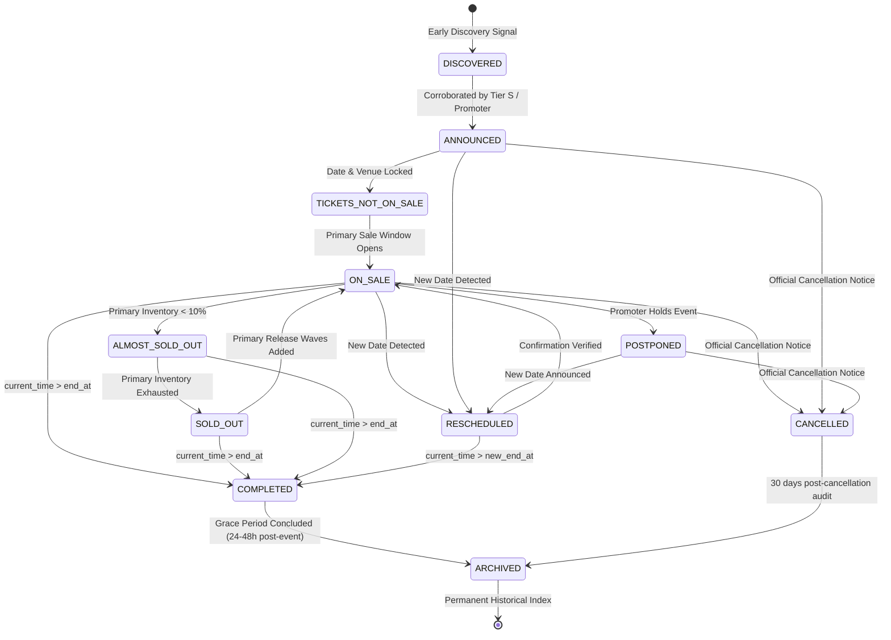

# TIKUM — EVENT LIFECYCLE & STATE MACHINE SPECIFICATION
**Operational Lifecycle & Transition Engine**  
**Version:** 1.0.0  
**Authority:** TIKUM Core Trust & Platform Engineering

---

## 1. Lifecycle State Machine Diagram



---

## 2. Deterministic State Transition Matrix

| Current State | Target State | Trigger Event | Guard Condition | Automated Action |
| :--- | :--- | :--- | :--- | :--- |
| `DISCOVERED` | `ANNOUNCED` | Ingestion from Tier S (promoter/venue) | Official name and artist verified | Create `EventStatusHistory`, assign canonical URL slug |
| `ANNOUNCED` | `TICKETS_NOT_ON_SALE`| Ticket sale date announced | `ticket_sale_start` timestamp set | Update `ticket_status`, set countdown timer |
| `TICKETS_NOT_ON_SALE`| `ON_SALE` | Current time reaches `ticket_sale_start`| `now >= ticket_sale_start` | Enable primary ticket link CTA |
| `ON_SALE` | `ALMOST_SOLD_OUT` | Primary platform reports <10% capacity | Primary ticketing feed telemetry | Display low inventory badge |
| `ON_SALE` | `SOLD_OUT` | Primary platform reports sold out | Primary ticketing feed telemetry | Switch primary CTA to "Sold Out Resmi", show secondary demand waitlist |
| `ANY_ACTIVE` | `RESCHEDULED` | Promoter/venue announces new date | New date corroborated by Tier S | Preserve `event_id`, write `EventStatusHistory` with old/new dates, notify sellers |
| `ANY_ACTIVE` | `POSTPONED` | Official indefinite delay notice | Promoter announcement corroborated | Pause resale listing approvals |
| `ANY_ACTIVE` | `CANCELLED` | Official cancellation notice | Tier S cancellation verification | **Cascade cancel linked active listings**, trigger escrow refunds, retain event in DB |
| `ANY_ACTIVE` | `COMPLETED` | Event show concludes | `now > (end_at || start_at + 4 hours)` | Disable ticket creation, mark event completed |
| `COMPLETED` | `ARCHIVED` | Retention sweep (daily 02:00 WIB) | `now > completed_at + 24 hours` | Move to permanent archive index, retain SEO JSON-LD |

---

## 3. The Archive Lifecycle: Upcoming $\rightarrow$ Completed $\rightarrow$ Archived

### 3.1 Principles of Preservation
In TIKUM, historical events are **high-value strategic assets**, not garbage data to be purged:
1. **Never delete completed events.** Historical event data anchors SEO authority, historical resale pricing data, and promoter/venue track records.
2. **Deterministic Automatic Transition:**
   $$\text{Trigger Condition: } \text{current\_time} > (\text{event.end\_at} \;\lor\; \text{event.start\_at} + 4\text{ hours})$$
3. **Transition Sequence:**
   - **Step 1 (Status: `COMPLETED`):** As soon as the end timestamp passes, the event transitions to `COMPLETED`. Any remaining unsold listings are marked `EXPIRED`.
   - **Step 2 (Status: `ARCHIVED`):** During the automated daily sweep (or 24 hours post-event), the event transitions to `ARCHIVED`.
   - **Step 3 (SEO Asset Delivery):** The page `/events/:slug` continues to respond with HTTP 200, serving an updated Schema.org `EventStatus: EventCompleted` structured payload, showing event highlights, setlists, and historical attendance without active ticket purchasing CTAs.

---

## 4. Handling Rescheduled Events (Identity Preservation)

When an event date changes (e.g. concert moved from October 15 to November 20):
1. **Zero Duplicate Creation:** The engine **must never** spawn a duplicate event entity.
2. **Auditable Transition:**
   An entry is generated in `EventStatusHistory`:
   ```json
   {
     "history_id": "hist-resched-01",
     "event_id": "ev-can-coldplay",
     "previous_status": "ON_SALE",
     "new_status": "RESCHEDULED",
     "previous_start_at": "2026-10-15T19:00:00+07:00",
     "new_start_at": "2026-11-20T19:00:00+07:00",
     "reason": "Promoter production schedule adjustment",
     "source_id": "src-promoter-pk-ent",
     "detected_at": "2026-09-11T14:30:00+07:00"
   }
   ```
3. **Marketplace Integrity:**
   Existing verified listings automatically update their scheduled date. Sellers receive an alert allowing them to confirm their availability or withdraw tickets without penalty.

---

## 5. Handling Cancelled Events (Safety & Refund Cascade)

When an event cancellation is confirmed by a Tier S source:
1. **State Update:** `event.status := CANCELLED`.
2. **Immutable Record:** The cancellation reason, reporting source, and timestamp are written to `EventStatusHistory`. The event entity is **never deleted**.
3. **Marketplace Cascade:**
   - Any active listing for this `event_id` in `state.listings` is immediately transitioned to `status := 'CANCELLED'`.
   - The reason `rejection_reason := "Event dibatalkan oleh pihak resmi: " + reason` is appended.
   - Any buyer orders in escrow are automatically flagged for dispute-free refund processing by Trust Officers.
   - Public event page displays a prominent official cancellation notice, suppressing all resale buy buttons.

---

## 6. Content Hashing & Change Detection

To prevent redundant database writes and churn:
1. **Content Hash Computation:**
   $$\text{Hash} = \text{SHA256}(\text{name} + \text{venue\_id} + \text{start\_at} + \text{end\_at} + \text{status} + \text{ticket\_status} + \text{ticket\_url})$$
2. **Evaluation:**
   - If incoming observation content hash matches the canonical event's stored hash: **No change recorded, sync skipped.**
   - If hash differs: The engine computes a field-by-field diff, updates only the modified attributes, and records entries in `EventChange`.
