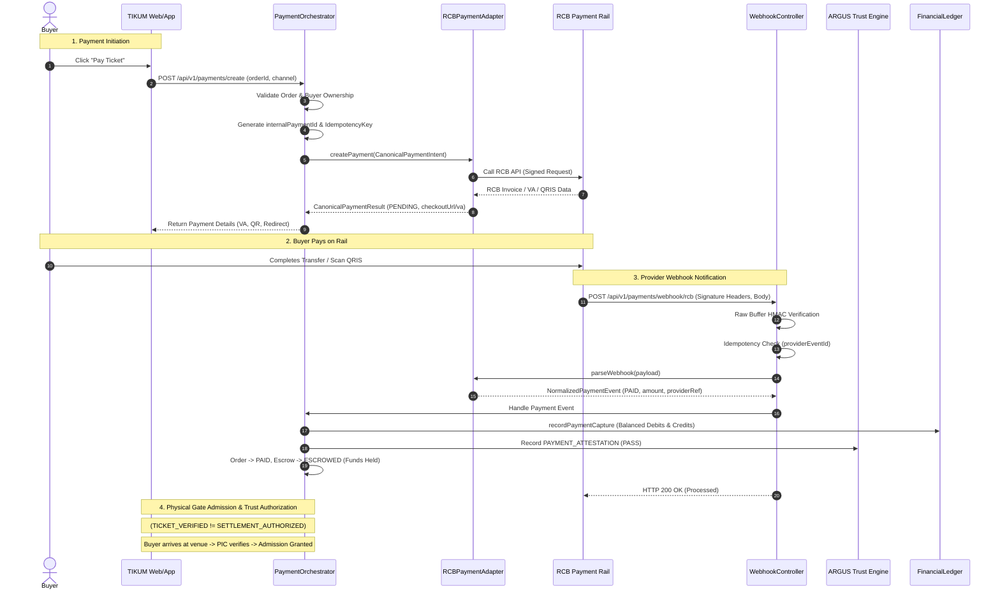
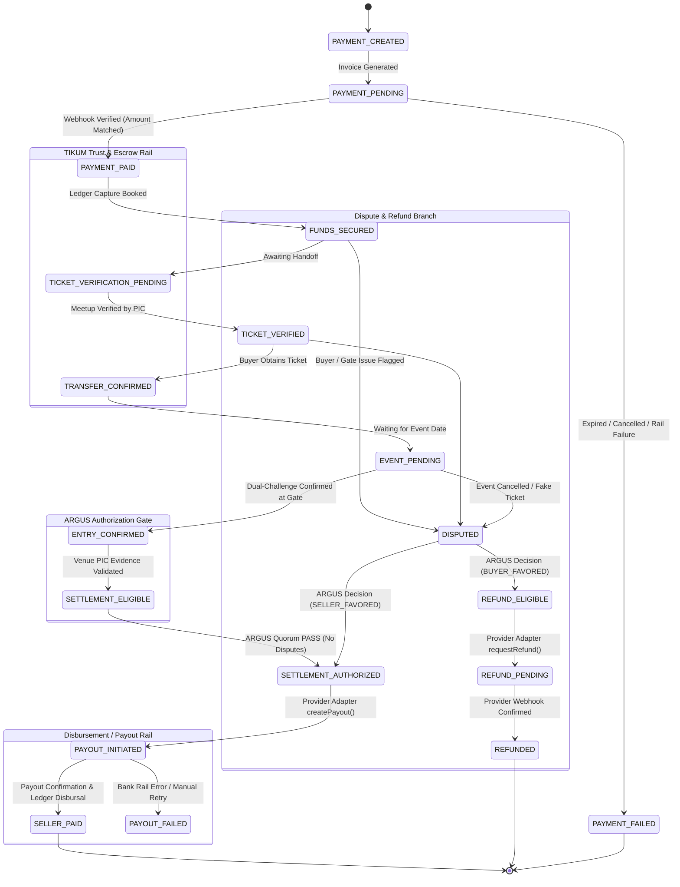

# TIKUM — PAYMENT & ESCROW INFRASTRUCTURE AUDIT & ARCHITECTURAL BLUEPRINT
## RCB MVP + Provider-Agnostic Payment Architecture

**Date:** 2026-10-02  
**Author:** Senior Principal Engineer  
**System:** TIKUM Trust Marketplace / ARGUS Trust Engine  
**Status:** PROPOSED & READY FOR IMPLEMENTATION GATES  

---

## EXECUTIVE SUMMARY

TIKUM is an Indonesia-first secondary ticket marketplace built on trust, verified ticket ownership, venue verification, escrow-like protection, dispute resolution, and eventual seller settlement.

This document establishes the **formal engineering audit** and **production-grade architecture plan** required before writing a single line of payment code. In accordance with the non-negotiable principle:

> **PAYMENT SUCCESS ≠ SETTLEMENT AUTHORIZED.**  
> TIKUM owns the business truth.  
> ARGUS owns the trust decision.  
> The Payment Provider moves the money.  
> Never confuse these three responsibilities.

---

## 1. CURRENT ARCHITECTURE AUDIT (PART 0)

### 1.1 Existing Model & Subsystem Inspection

| Subsystem / Model | File Location | Current Responsibilities & Implementation | Key Flaws & Vulnerabilities |
| :--- | :--- | :--- | :--- |
| **Order Model** | `src/database.js`<br>`src/services/escrowService.js`<br>`src/services/marketplace/MarketplaceOrderService.js` | In-memory `state.orders`. Snapshots quote pricing (`ticket_price`, `buyer_fee`, `seller_fee`, taxes). Has dual status fields (`status` and `marketplace_status`). | Status fields can drift. Lacks dedicated provider payment tracking fields (`provider_transaction_id`, `provider_reference`, `provider_fee`, `net_amount`). |
| **Ticket Model** | `src/database.js`<br>`src/trust/TicketTrustService.js` | In-memory `state.tickets`. Enforces barcode hash uniqueness, verification status (`SUBMITTED` → `VERIFIED`), and lifecycle (`AVAILABLE` → `LOCKED` → `ESCROWED` → `REDEEMED`). | Sound domain model. Completely independent from payment gateway. |
| **Seller Model** | `src/database.js`<br>`src/trust/SellerTrustService.js` | `state.users` + `state.seller_profiles`. Evaluated via 4-pillar trust model (Identity, Transaction, Ticket, Behavior Risk). | Settlement does not currently verify seller KYC status or payout eligibility before triggering disbursement. |
| **Buyer Model** | `src/database.js`<br>`src/services/transactionChallengeService.js` | `state.users` (role `buyer`). Generates 6-digit cryptographic handshake challenges for turnstile admission. | Client can currently trigger payment confirmation without provider proof via `/api/mvp/buyer/pay`. |
| **Event & Venue Models** | `src/database.js`<br>`src/discovery/CanonicalEventRegistry.js`<br>`src/discovery/VenueRegistry.js` | Robust temporal lifecycle (`EventTemporalLifecycleEngine`), admission protocols, and physical gate mappings. | Decoupled and clean. |
| **PaymentService** | `src/services/payment/PaymentService.js` | Unified interface calling `paymentManager.getProvider(...)`. Enforces 5 Production Safety Gates (`NO_REAL_PAYMENT`, `NO_REAL_SETTLEMENT`, etc.). | Does not route into order fulfillment; `handleWebhook` is not connected to any router endpoint. |
| **Payment Routes** | `src/api/mvpRouter.js` | Single route `POST /api/mvp/buyer/pay`. | **CRITICAL DEFECT:** Accepts arbitrary client-supplied `amountPaid` and `providerRef`, immediately calling `EscrowService.recordPayment`. No webhook endpoint exists! |
| **Seller Settlement Logic** | `src/services/settlementService.js`<br>`src/services/escrowService.js` | `SettlementService.executeSettlement` simulates payouts (`mode: 'SIMULATED'`, `payout_ref: disb-...`). `releaseToSeller` checks `ENTRY_CONFIRMED` & `TrustPolicyEngine`. | Payout is simulated; does not call provider payout rail or verify provider capability. |
| **Refund Logic** | `src/services/escrowService.js`<br>`src/services/disputeService.js` | `EscrowService.refundToBuyer` mutates `escrow.status = REFUNDED` and records ledger reversal. | Does not invoke `provider.refund()`. No handling for async gateway refund failures. |
| **Dispute Logic** | `src/services/disputeService.js` | Evidence-backed dispute resolution. Requires physical PIC evidence. Step-up auth required for admin override. | Resolving dispute with `REFUND_BUYER` triggers internal state change without external refund execution. |
| **FinancialLedger** | `src/settlement/FinancialLedger.js` | Mathematical double-entry bookkeeping ($\sum \text{Debits} = \sum \text{Credits}$). Immutable append-only journal in `state.financial_ledger`. | Lacks `PROVIDER_FEE_EXPENSE` and `ESCROW_HOLD_CLEARING` accounts. |
| **Event PIC & Venue Operations** | `src/venue/VenueOperationsService.js`<br>`src/services/eventPicService.js` | Turnstile gate verification, dual-confirmation codes, shift assignments, and incident logging. | Operational moat is strong: `TICKET_VERIFIED !== ENTRY_CONFIRMED`. |
| **ARGUS Trust Engine** | `src/trust/TrustPolicyEngine.js` | Multi-party attestation quorum (`PLATFORM`, `SELLER`, `PAYMENT`, `PIC`, `BUYER`, `VENUE_ENTRY`). Strict anti-conflict-of-interest and velocity anomaly checks. | Trust engine is authoritative; properly blocks unauthorized release. |
| **Database Schema** | `src/database.js` | In-memory Javascript objects mimicking tables. Documented in `ADR_PERSISTENCE_BOUNDARY.js`. | In-memory state is lost on process restart. Lacks relational constraints for payment/webhook entities. |
| **Webhook Infrastructure** | `src/services/payment/PaymentService.js` | Signature verification logic exists for iPaymu and TestProvider. `state.processed_webhooks` Set for idempotency. | **NO HTTP ROUTE MOUNTED.** Express `body-parser` parses JSON before signature validation, breaking byte-exact HMAC checks. |
| **Admin Controls** | `src/api/adminRouter.js` | Real-time overview of users, orders, tickets, and ledger account balances. | Read-only; lacks reconciliation UI and provider health monitoring. |
| **Reconciliation** | N/A | None exists in codebase. | Missing entirely. No reconciliation jobs, logs, or variance detection. |

---

### 1.2 Identified Architectural Deficiencies (A to L)

* **A. Reusable Components:**
  * `PaymentProvider` abstract base class (well-structured, needs method expansion).
  * `PaymentManager` multi-provider registry.
  * `FinancialLedger` balanced double-entry accounting engine.
  * `EscrowStateMachine` 11-step lifecycle states.
  * `TrustPolicyEngine` attestation-based authorization.
  * `EventPicService` turnstile gate verification with dual-challenge handshake.
* **B. Duplicated Payment Logic:**
  * Both `POST /api/mvp/buyer/pay` in `mvpRouter.js` and `MarketplaceOrderService.processPaymentCallback` invoke `EscrowService.recordPayment` with divergent assumptions.
* **C. Dangerous Financial Assumptions:**
  * The frontend can trigger `POST /api/mvp/buyer/pay` with arbitrary parameters to lock escrow without gateway confirmation.
  * Payouts assume calling `SettlementService.executeSettlement` marks funds as paid to the seller without executing a banking rail disburse.
* **D. Mock / Stub Payment Behavior:**
  * `SettlementService` returns `mode: 'SIMULATED'` and hardcoded bank accounts.
  * Direct payment endpoint allows simulated payment capture.
* **E. Missing Idempotency:**
  * Payment initiation has no idempotency table.
  * Webhook deduplication uses an in-memory `Set` that evaporates on server reload.
  * Refunds have no dedicated idempotency key check in `EscrowService.refundToBuyer`.
* **F. Missing Webhook Verification & Routing:**
  * Webhook route `/api/mvp/payment/webhook` is documented in admin trust router but does not exist in Express routes.
  * Express parses JSON bodies before HMAC verification, mutating whitespace and headers.
* **G. Missing Reconciliation:**
  * Zero automated comparison between TIKUM transaction states and provider reports.
* **H. Missing Ledger Entries:**
  * Gateway fees (`provider_fee`) are not booked to an operational expense ledger account.
* **I. Missing Refund Handling:**
  * Refunds never call the gateway provider adapter; balances are modified internally without financial rail settlement.
* **J. Missing Settlement Controls:**
  * Payout does not check seller bank account verification, KYC status, or provider delayed-payout capability.
* **K. Security Risks:**
  * Direct client access to payment completion.
  * Absence of raw body buffering for webhook HMAC verification.
  * Risk of double-payout if admin executes settlement multiple times with different keys.
* **L. RCB Technical Debt Risks:**
  * Leaking RCB-specific invoice IDs, payment status codes (`PAID`, `EXPIRED`), or fees directly into `order` or `escrow` records.

---

## 2. PAYMENT FLOW DIAGRAM (PART 1 & 17)



---

## 3. SETTLEMENT STATE MACHINE (PART 4 & 5)



---

## 4. DATABASE CHANGES (PART 3 & 25)

To ensure backward compatibility while supporting durable persistence and provider agnosticism, the following additive tables/stores will be created:

### 4.1 New Canonical Entities

#### `canonical_payments`
* `id` (PK, string: `pay-xxx`)
* `order_id` (Indexed, string)
* `buyer_id` (Indexed, string)
* `seller_id` (Indexed, string)
* `event_id` (Indexed, string)
* `ticket_id` (Indexed, string)
* `provider` (Indexed, string: `'rcb'`, `'ipaymu'`, `'test_provider'`)
* `provider_transaction_id` (Indexed, string, nullable)
* `provider_reference` (Indexed, string)
* `idempotency_key` (Unique index, string)
* `currency` (string: `'IDR'`)
* `gross_amount` (integer: Total paid by buyer)
* `platform_fee` (integer: Tikum fee)
* `seller_amount` (integer: Net owed to seller)
* `provider_fee` (integer: Gateway processing fee)
* `tax_amount` (integer: Withheld and collected taxes)
* `net_amount` (integer: gross - provider_fee)
* `status` (Indexed, enum: `CREATED`, `PENDING`, `PAID`, `FAILED`, `CANCELLED`, `EXPIRED`, `REFUNDED`, `DISPUTED`)
* `payment_channel` (string: e.g. `'QRIS'`, `'VA_BCA'`, `'VA_MANDIRI'`)
* `checkout_url` (text, nullable)
* `va_number` (string, nullable)
* `paid_at` (ISO timestamp, nullable)
* `created_at` (ISO timestamp)
* `updated_at` (ISO timestamp)
* `metadata` (JSON text)

#### `provider_webhooks`
* `id` (PK, string: `pwh-xxx`)
* `provider` (Indexed, string: `'rcb'`)
* `provider_event_id` (Unique index, string)
* `event_type` (string: e.g. `'PAYMENT_SUCCESS'`, `'REFUND_SUCCESS'`)
* `signature_status` (string: `'VALID'`, `'INVALID'`, `'SKIPPED'`)
* `processing_status` (Indexed, enum: `'PROCESSED'`, `'REJECTED'`, `'FAILED'`, `'DUPLICATE'`)
* `payload_hash` (string: SHA256 of raw body)
* `raw_payload` (JSON text)
* `received_at` (ISO timestamp)
* `processed_at` (ISO timestamp, nullable)
* `retry_count` (integer, default 0)
* `error_message` (text, nullable)

#### `settlement_records`
* `id` (PK, string: `stl-xxx`)
* `order_id` (Unique index, string)
* `payment_id` (string)
* `seller_id` (Indexed, string)
* `provider` (string: `'rcb'`)
* `provider_payout_id` (string, nullable)
* `amount` (integer)
* `currency` (string: `'IDR'`)
* `authorization_id` (string: ARGUS Trust authorization reference)
* `bank_account` (JSON text: sanitized bank code, account number, account name)
* `status` (enum: `'AUTHORIZED'`, `'INITIATED'`, `'DISBURSED'`, `'FAILED'`, `'REJECTED'`)
* `idempotency_key` (Unique index, string)
* `executed_by` (string)
* `executed_at` (ISO timestamp, nullable)
* `failure_reason` (text, nullable)

#### `payment_reconciliation_logs`
* `id` (PK, string: `rec-xxx`)
* `batch_id` (Indexed, string)
* `reconciliation_date` (ISO date)
* `provider` (string: `'rcb'`)
* `internal_transaction_id` (string)
* `provider_transaction_id` (string)
* `variance_type` (enum: `'MATCH'`, `'AMOUNT_MISMATCH'`, `'STATUS_MISMATCH'`, `'MISSING_INTERNAL'`, `'MISSING_PROVIDER'`)
* `internal_amount` (integer)
* `provider_amount` (integer)
* `status` (enum: `'RESOLVED'`, `'OPEN'`, `'INVESTIGATION_REQUIRED'`)
* `created_at` (ISO timestamp)

---

## 5. PROVIDER ABSTRACTION ARCHITECTURE (PART 1 & 16)

### 5.1 Canonical `PaymentProviderInterface` Contract

```javascript
/**
 * Canonical contract implemented by all payment rails.
 */
class PaymentProviderInterface {
  getName();                                      // 'rcb' | 'ipaymu' | 'midtrans' | 'doku' | 'xendit'
  getCountry();                                   // 'ID'
  getStatus();                                    // { status, isVerified, message, readiness }
  getCapabilities();                              // ProviderCapabilities
  async createPayment(intent);                    // Returns CanonicalPaymentResult
  async getPaymentStatus(query);                  // Returns CanonicalPaymentStatus
  async verifyWebhook(rawBuffer, headers);        // Returns boolean
  parseWebhook(rawBody);                          // Returns CanonicalPaymentEvent
  async requestRefund(refundReq);                 // Returns CanonicalRefundResult (or throws CAPABILITY_UNSUPPORTED)
  async createPayout(payoutReq);                  // Returns CanonicalPayoutResult (or throws CAPABILITY_UNSUPPORTED)
  async reconcileTransaction(reconcileReq);       // Returns ReconciliationStatus
}
```

### 5.2 Provider Capability Matrix

```javascript
const PROVIDER_CAPABILITIES = {
  rcb: {
    paymentCollection: true,
    supportedChannels: ['QRIS', 'VA_BCA', 'VA_MANDIRI', 'VA_BRI', 'VA_BNI', 'REKBER_ESCROW'],
    escrowHoldRelease: 'PENDING_DOCUMENTATION_VERIFICATION', // NEVER ASSUME
    splitSettlement: 'PENDING_DOCUMENTATION_VERIFICATION',
    payout: 'PENDING_DOCUMENTATION_VERIFICATION',
    refund: 'PENDING_DOCUMENTATION_VERIFICATION',
    webhooks: true,
    reconciliationApi: 'PENDING_DOCUMENTATION_VERIFICATION'
  },
  ipaymu: {
    paymentCollection: true,
    supportedChannels: ['QRIS', 'BCA_VA', 'MANDIRI_VA', 'BNI_VA', 'BRI_VA', 'BAGIBAGI_ESCROW'],
    escrowHoldRelease: true,
    splitSettlement: true,
    payout: false, // requires manual clearing
    refund: false,
    webhooks: true,
    reconciliationApi: false
  },
  midtrans: {
    paymentCollection: true,
    supportedChannels: ['SNAP_POPUP', 'QRIS', 'VA_ALL', 'GOPAY', 'SHOPEEPAY'],
    escrowHoldRelease: false, // Standard aggregator
    splitSettlement: false,
    payout: true, // Iris payout engine
    refund: true,
    webhooks: true,
    reconciliationApi: true
  },
  xendit: {
    paymentCollection: true,
    supportedChannels: ['INVOICE', 'QRIS', 'VA_ALL', 'EWALLET', 'CARDS'],
    escrowHoldRelease: true, // Platform / Split accounts
    splitSettlement: true,
    payout: true, // XenDisburse
    refund: true,
    webhooks: true,
    reconciliationApi: true
  }
};
```

---

## 6. RCB INTEGRATION PLAN (PART 2 & 23)

### 6.1 Strict Due Diligence & Reality Protocol
* **No Speculation:** We do NOT assume RCB possesses native milestone-based escrow release APIs until official API documentation and contract terms are provided.
* **Fallback Design:** If RCB operates solely as a collection rail:
  1. Buyer pays RCB.
  2. Funds settle into TIKUM's corporate trust/escrow clearing account.
  3. ARGUS governs the escrow hold internally in `FinancialLedger` and `EscrowStateMachine`.
  4. Upon turnstile admission (`ENTRY_CONFIRMED` + ARGUS `PASS`), payout is executed via bank transfer rail or RCB payout if available.

### 6.2 Adapter Responsibilities (`RCBPaymentProvider`)
1. **API Client:** Configured with `RCB_API_BASE_URL`, `RCB_API_KEY`, `RCB_SECRET_KEY`, `RCB_CLIENT_ID`.
2. **Request Signing:** Implements RCB's HMAC-SHA256 signature specification over timestamp, nonce, and HTTP body.
3. **Timeout & Retries:** Strict 8000ms timeout with exponential backoff (max 2 retries, idempotency key attached).
4. **Normalized DTOs:** Converts RCB JSON into `CanonicalPaymentResult`. Leaks zero `rcb_` prefixed variables into domain code.
5. **Webhook Verifier:** Validates raw request buffer with timing-safe comparison.

---

## 7. SECURITY MODEL (PART 19)

1. **Raw Body Buffer Preservation:**
   * Configure Express to preserve `req.rawBody` on `/api/v1/payments/webhook/*` BEFORE JSON parsing.
2. **Timing-Safe HMAC:**
   * Use `crypto.timingSafeEqual` for all signature evaluations.
3. **No Secret Leakage:**
   * Scrub all secrets, API keys, credentials, and raw card details from structured logs and audit trails.
4. **Idempotency Gate:**
   * Every financial mutation requires an `idempotency_key`. Duplicates are returned cached responses without execution.
5. **Admin Step-Up Authentication:**
   * Manual payout triggers and dispute overrides require `verifyAdminStepUp` with cost-12 bcrypt validation.
6. **Role-Based Access Control (RBAC):**
   * Buyers cannot trigger payment confirmations.
   * Sellers cannot confirm venue entries.
   * PICs cannot issue settlement releases.

---

## 8. WEBHOOK MODEL (PART 10)

1. **Dedicated Ingestion Endpoint:** `POST /api/v1/payments/webhook/:provider`
2. **Replay & Timestamp Protection:** Verify `x-signature` and `x-timestamp` (reject requests older than 300 seconds).
3. **Persistence of Event Records:** Record in `provider_webhooks` table with hash of raw body.
4. **Idempotent Dispatch:**
   * If `provider_event_id` exists with status `PROCESSED`: immediately return HTTP 200 `DUPLICATE_IGNORED`.
   * If processing: execute within `releaseMutex` lock to eliminate concurrent race conditions.
5. **Fail-Safe Response:** Return HTTP 400/401 for invalid signatures; return HTTP 500 only on fatal transient infrastructure errors to prompt gateway retry.

---

## 9. RECONCILIATION MODEL & FINANCIAL INVARIANTS (PART 9 & 12)

### 9.1 Mathematical Double-Entry Invariants
For EVERY captured transaction:
$$\text{Gross Buyer Payment} = \text{Seller Net Payout} + \text{Platform Fee} + \text{Provider Fee} + \text{Taxes Withheld/Collected}$$

$$\sum \text{Debits} \equiv \sum \text{Credits}$$

### 9.2 Daily Automated Reconciliation
A reconciliation worker will compare:
* Internal transactions vs Gateway reported settlements.
* Any variance ($\Delta \text{Amount} \neq 0$ or $\text{Status Misalignment}$) flags an immediate `RECONCILIATION_EXCEPTION` in the Admin Control Center and blocks automatic payouts for that order.

---

## 10. TESTING PLAN (PART 21)

1. **Unit Tests:**
   * `test_rcb_adapter_normalization.js`: Validates input/output DTO mapping and error handling.
   * `test_payment_orchestrator.js`: Validates provider routing, idempotency, and capability checks.
   * `test_webhook_hmac_security.js`: Validates timing-safe comparison, forged signature rejection, and replay protection.
   * `test_financial_ledger_rcb.js`: Validates double-entry balancing with provider fee splits.
2. **Integration Tests:**
   * `test_payment_order_lifecycle.js`: Reservation → Payment Pending → Webhook Paid → Escrow Held → Turnstile PIC Admission → Trust Quorum → Settlement.
   * `test_duplicate_webhook_storm.js`: Floods 20 concurrent identical webhooks; asserts exactly 1 ledger capture.
   * `test_refund_dispute_integration.js`: Tests evidence-backed dispute refund flow.
3. **Regression Tests:**
   * Run full existing test suite (`npm test`) to guarantee zero regression across discovery, SEO, and legacy trust flows.

---

## 11. PRODUCTION GATE CHECKLIST (PART 30)

```markdown
[ ] 1. Provider-Agnostic Abstraction complete & verified
[ ] 2. RCB Adapter implemented in isolation (zero domain leakage)
[ ] 3. Raw Body Buffer webhook verification working with timing-safe HMAC
[ ] 4. Direct `/api/mvp/buyer/pay` mock bypass neutralized & secured
[ ] 5. Multi-event webhook idempotency verified with persistent deduplication
[ ] 6. FinancialLedger balance verified ($\sum Debits == \sum Credits$)
[ ] 7. Seller settlement hard-gated by ARGUS Trust Engine & confirmed admission
[ ] 8. Admin Control Center payment & reconciliation views functional
[ ] 9. All automated test suites passing with 100% success rate
[ ] 10. Secrets removed from code; `.env.example` updated with placeholders
[ ] 11. Production safety flag `ENABLE_RCB_PRODUCTION=false` until sandbox contract sign-off
```

---

## 12. FILES THAT WILL BE MODIFIED

1. `src/server.js` (Add raw body parser hook for webhook endpoint and mount new payment router)
2. `src/database.js` (Add tables: `canonical_payments`, `provider_webhooks`, `settlement_records`, `payment_reconciliation_logs`)
3. `src/services/payment/PaymentProvider.js` (Enhance interface methods and capability declarations)
4. `src/services/payment/PaymentService.js` (Refactor into `PaymentOrchestrator`)
5. `src/services/payment/index.js` (Register RCB adapter and export orchestrator)
6. `src/settlement/FinancialLedger.js` (Add `PROVIDER_FEE_EXPENSE` account and support provider fee entries)
7. `src/services/marketplace/MarketplaceOrderService.js` (Align payment initiation and callback handling)
8. `src/api/mvpRouter.js` (Secure `POST /buyer/pay` so it cannot be used to fake payment success)
9. `src/api/adminRouter.js` (Expose payment reconciliation and provider health metrics)
10. `.env.example` (Add RCB configuration placeholders)

---

## 13. FILES THAT SHOULD NOT BE MODIFIED

* `src/trust/TrustPolicyEngine.js` (ARGUS core trust decision logic must remain authoritative and untainted)
* `src/trust/TicketTrustService.js` (Ticket validity is independent of financial rails)
* `src/trust/SellerTrustService.js` (Seller trust scoring is independent of financial rails)
* `src/venue/VenueOperationsService.js` (Physical gate operations must remain independent of financial rails)
* `src/services/eventPicService.js` (Turnstile admission protocol & dual-challenge codes must remain independent)
* `src/discovery/*` (Discovery and SEO engines must remain firewalled from marketplace payments)

---

## 14. RISKS & MITIGATION

| Risk | Impact | Mitigation Strategy |
| :--- | :--- | :--- |
| **Gateway Webhook Replay / Forgery** | Double ledger credits or fake orders | Timing-safe HMAC validation, replay timestamp window check, and persistent `provider_event_id` uniqueness. |
| **Premature Escrow Release** | Financial loss if ticket was fake | Hard gate: Settlement release requires `ENTRY_CONFIRMED` + ARGUS Trust Engine `PASS`. |
| **In-Memory State Loss on Vercel** | Transaction history lost on cold restart | Implement database tables with clear schema migration and maintain zero-leakage ADR persistence boundaries. |
| **Provider Network Timeouts** | Inconsistent order states | Explicit idempotency keys on every outgoing request; automated reconciliation polling. |
| **Provider Capability Gap** | Assuming RCB can hold escrow when it cannot | Mark RCB capability as unverified; use TIKUM internal ledger escrow holding as the authoritative boundary. |

---

## 15. ROLLBACK STRATEGY

1. **Feature Flag Kill-Switch:**
   * `ENABLE_RCB_PROVIDER=false` in environment variables immediately routes requests to maintenance / offline responses without throwing unhandled exceptions.
2. **Provider Swapping:**
   * Because `PaymentOrchestrator` relies on `PaymentProviderInterface`, swapping primary provider from `rcb` to `ipaymu` or `test_provider` requires altering a single configuration key (`DEFAULT_PAYMENT_PROVIDER=xxx`).
3. **Database Additive Guarantee:**
   * All schema changes are strictly additive (`canonical_payments`, `provider_webhooks`). No existing columns or records are dropped or destructively altered.
