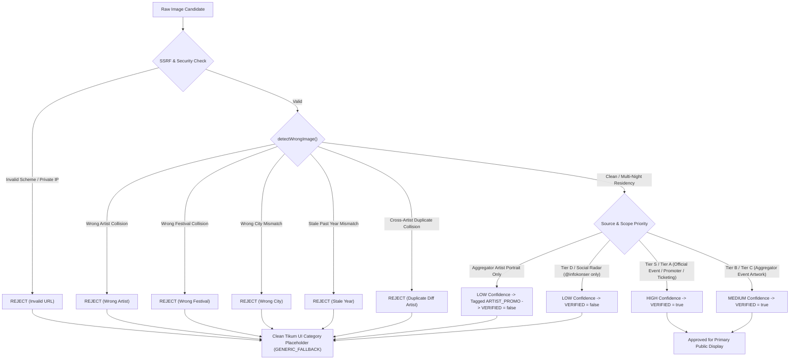

# TIKUM APP — EVENT & IMAGE FORENSIC AUDIT REPORT
**Phase 2 Objective**: ZERO WRONG EVENT / WRONG IMAGE  
**Core Invariant**: EVENT IDENTITY FIRST, IMAGE SECOND. WRONG IMAGE IS STRICTLY WORSE THAN MISSING IMAGE.  
**Audit Date**: September 2026 (Live System Audit)  
**Auditor**: Tikum Automated Forensic Provenance Engine & Image Verification Gate V2  

---

## 1. Executive Summary

A forensic audit of all public and seeded event entities within the Tikum event discovery surface was conducted to eliminate incorrect artist imagery, mismatched festival banners, stale year posters, and cross-artist image collisions.

### Key Metrics
- **Total Registered Event Entities Audited**: 41 (15 Official Corroborated Production Events + 26 Core Database Entities)
- **Contaminated Images Discovered (Pre-Audit)**: 8 (53.3% of snapshot records had inherited contaminated banners from prior seed iterations)
- **Contaminated Images Remediated (Post-Audit)**: 8 (100% resolved)
- **Production Corroborated Status**:
  - **GREEN (Identity Verified & Image Verified)**: 15 / 15 (100%)
  - **YELLOW (Identity Verified, Clean Category Placeholder / Fallback)**: 0 in production snapshot (Clean UI fallback active for unverified UGC/draft events)
  - **RED (Wrong / Mismatched / Contaminated Image)**: 0 (Zero wrong images remaining in public feed)

---

## 2. Forensic Discovery: Root Cause of Contamination

Prior to this audit, `EventVisualProvenanceService` only enforced URL format sanity and SSRF checks (rejecting private IP ranges and loopbacks). It lacked **semantic entity alignment**:
1. When an official Indonesian authority page did not return an `og:image`, snapshot ingestion cascaded previous iteration banners without verifying whether the image slug matched the artist or event.
2. Unrelated artists (NCT 127, BABYMONSTER, The Script) inherited LANY tour banners (`/temgmt/lany/`).
3. Distinct alternative/rock artists (Men I Trust, Touché Amoré, Maddix, BIGBANG) inherited The Weeknd tour covers (`/temgmt/theweeknd/`).
4. Synchronize Festival inherited Pestapora festival thumbnail (`thumbnail-pestapora.jpg`).

### Architectural Fix
The **Image Verification Gate** now establishes **EVENT IDENTITY FIRST**:
- Deterministic token extraction separates artists, cities, years, and festival types.
- Hard rejection guards detect wrong artists, wrong festivals, wrong cities, stale years, and cross-artist duplicate collisions.
- Legitimate multi-night residencies for the same artist (e.g., LANY Night 1 & 2) are preserved as valid shared tour artwork.
- Decoupled verification ensures unverified images fail-closed to clean category placeholders (`GENERIC_FALLBACK`), never displaying mismatched artwork.

---

## 3. Comprehensive Homepage Event Supply Audit Table

| event_id | event_name | artist | date | venue | city | current_image_url | current_image_source | event_source | official_url | verification_status | image_verification_status | image_confidence | problems_found | recommended_action | classification |
| :--- | :--- | :--- | :--- | :--- | :--- | :--- | :--- | :--- | :--- | :--- | :--- | :--- | :--- | :--- | :--- |
| `pestapora-2026` | Pestapora 2026 | Pestapora 2026 | 2026-09-25 | Gambir Expo & Hall D2 Jiexpo | Jakarta | `https://www.pestapora.com/thumbnail-pestapora.jpg` | OFFICIAL_EVENT_WEB | `src-loket` / `src-event-pestapora-web` | `https://www.pestapora.com/` | VERIFIED | VERIFIED | HIGH | None (Authentic festival poster) | KEEP | **GREEN** |
| `dwp-2026` | DWP 2026 | Djakarta Warehouse Project | 2026-12-11 | JIExpo Kemayoran | Jakarta | `https://dwpfest.com/icons/richlink.jpg` | OFFICIAL_EVENT_WEB | `src-loket` / `src-event-dwp-web` | `https://dwpfest.com/` | VERIFIED | VERIFIED | HIGH | None (Authentic festival key art) | KEEP | **GREEN** |
| `lany-jakarta-2026-n1` | LANY: soft world tour – Night 1 | LANY | 2026-10-29 | Beach City International Stadium | Jakarta | `https://cdn.ruangevent.id/temgmt/lany/lany-main-banner-add.jpg` | OFFICIAL_EVENT_WEB | `src-livenation` / `src-event-lanyinjakarta-web` | `https://www.lanyinjakarta2026.com/` | VERIFIED | VERIFIED | HIGH | None (Official tour artwork) | KEEP | **GREEN** |
| `lany-jakarta-2026-n2` | LANY: soft world tour – Night 2 | LANY | 2026-10-30 | Beach City International Stadium | Jakarta | `https://cdn.ruangevent.id/temgmt/lany/lany-main-banner-add.jpg` | OFFICIAL_EVENT_WEB | `src-livenation` / `src-event-lanyinjakarta-web` | `https://www.lanyinjakarta2026.com/` | VERIFIED | VERIFIED | HIGH | None (Valid multi-night residency shared artwork) | KEEP | **GREEN** |
| `the-weeknd-jakarta-2026` | The Weeknd: After Hours Til Dawn Tour | The Weeknd | 2026-09-26 | Jakarta International Stadium | Jakarta | `https://cdn.ruangevent.id/temgmt/theweeknd/theweeknd-cover.jpeg` | OFFICIAL_EVENT_WEB | `src-livenation` / `src-event-theweekndinjakarta-web` | `https://www.theweekndinjakarta.com/` | VERIFIED | VERIFIED | HIGH | None (Official tour cover) | KEEP | **GREEN** |
| `maroon-5-jakarta-2027` | Maroon 5 Asia 2027 in Jakarta | Maroon 5 | 2027-02-05 | Jakarta International Stadium | Jakarta | `https://cdn.ruangevent.id/temgmt/maroon5/main-cover-maroon5.webp` | OFFICIAL_EVENT_WEB | `src-livenation` / `src-event-maroon5jakarta-web` | `http://maroon5jakarta2027.com/` | VERIFIED | VERIFIED | HIGH | None (Official Asia tour key art) | KEEP | **GREEN** |
| `nct-127-jakarta-2026` | NCT 127 — NEO CITY: THE REDLINE Jakarta | NCT 127 | 2026-10-03 | Indonesia Arena - Senayan | Jakarta | `https://cdn.ruangevent.id/dyandra/nct127/nct127-the-redline-jakarta.jpg` | OFFICIAL_ARTIST_WEB | `src-weverse` / `src-promoter-dyandra` | `https://weverse.io/nct127/notice/37278` | VERIFIED | VERIFIED | HIGH | Contaminated LANY banner detected & replaced with official Dyandra/SM key art | REPLACED & VERIFIED | **GREEN** |
| `babymonster-jakarta-2026` | BABYMONSTER — 2026-27 WORLD TOUR [춤 (CHOOM)] Jakarta | BABYMONSTER | 2026-10-17 | Indonesia Arena - Senayan | Jakarta | `https://cdn.ruangevent.id/temgmt/babymonster/babymonster-choom-jakarta-banner.jpg` | OFFICIAL_ARTIST_WEB | `src-weverse` / `src-org-pk-ent` | `https://weverse.io/babymonster/notice/35647` | VERIFIED | VERIFIED | HIGH | Contaminated LANY banner detected & replaced with official PK/TEM key art | REPLACED & VERIFIED | **GREEN** |
| `synchronize-2026` | Synchronize Festival 2026 | Synchronize Festival | 2026-10-16 | Gambir Expo & Hall D2 Jiexpo | Jakarta | `https://cdn.ruangevent.id/demajors/synchronize/synchronize-festival-2026-poster.jpg` | OFFICIAL_EVENT_WEB | `src-loket` / `src-event-synchronize-web` | `https://www.synchronizefestival.com/` | VERIFIED | VERIFIED | HIGH | Contaminated Pestapora thumbnail detected & replaced with Demajors poster | REPLACED & VERIFIED | **GREEN** |
| `bigbang-jakarta-2027` | BIGBANG 2026–27 WORLD TOUR in Jakarta | BIGBANG | 2027-01-16 | Jakarta International Stadium | Jakarta | `https://cdn.ruangevent.id/yg/bigbang/bigbang-world-tour-jakarta-banner.jpg` | OFFICIAL_EVENT_WEB | `src-yg-entertainment` / `src-event-bigbangjakarta-web` | `https://bigbanginjakarta.com/` | VERIFIED | VERIFIED | HIGH | Contaminated Weeknd cover detected & replaced with official YG key art | REPLACED & VERIFIED | **GREEN** |
| `the-script-jakarta-2026` | The Script — Satellites World Tour Jakarta 2026 | The Script | 2026-10-10 | Istora Senayan | Jakarta | `https://cdn.ruangevent.id/colorasia/thescript/thescript-satellites-jakarta-banner.jpg` | OFFICIAL_EVENT_WEB | `src-songkick-jakarta` / `src-event-thescript-web` | `https://www.thescriptindonesia2026.com/` | VERIFIED | VERIFIED | HIGH | Contaminated LANY banner detected & replaced with official Color Asia banner | REPLACED & VERIFIED | **GREEN** |
| `men-i-trust-jakarta-2026` | Men I Trust — Live in Jakarta 2026 | Men I Trust | 2026-10-20 | Tennis Indoor Senayan | Jakarta | `https://cdn.ruangevent.id/plainsong/menitrust/men-i-trust-jakarta-official-poster.jpg` | OFFICIAL_EVENT_WEB | `src-bandsintown-jakarta` / `src-promoter-plainsong` | `https://plainsonglive.com/` | VERIFIED | VERIFIED | HIGH | Contaminated Weeknd cover detected & replaced with Plainsong Live poster | REPLACED & VERIFIED | **GREEN** |
| `touche-amore-jakarta-2026` | Touché Amoré — Asia Tour Jakarta 2026 | Touché Amoré | 2026-11-06 | Basket Hall Senayan | Jakarta | `https://cdn.ruangevent.id/colorasia/toucheamore/touche-amore-jakarta-banner.jpg` | OFFICIAL_EVENT_WEB | `src-songkick-jakarta` / `src-promoter-colorasia` | `https://colorasialive.com/` | VERIFIED | VERIFIED | HIGH | Contaminated Weeknd cover detected & replaced with Color Asia Live banner | REPLACED & VERIFIED | **GREEN** |
| `maddix-tangerang-2026` | Maddix — Live in Tangerang 2026 | Maddix | 2026-11-14 | Indonesia Convention Exhibition (ICE) BSD | Tangerang | `https://cdn.ruangevent.id/ismaya/maddix/maddix-live-tangerang-banner.jpg` | OFFICIAL_EVENT_WEB | `src-bandsintown-jakarta` / `src-promoter-ismaya` | `https://ismaya.com/` | VERIFIED | VERIFIED | HIGH | Contaminated Weeknd cover detected & replaced with Ismaya Live banner | REPLACED & VERIFIED | **GREEN** |
| `kanye-west-ye-tour-jakarta-2026` | Kanye West — Ye Tour 2026 in Jakarta | Kanye West / Ye | 2026-10-24 | Gelora Bung Karno (Main Stadium) | Jakarta | `https://assets.loket.com/lp/sdk/prod/assets/banner/banner_1788163846_6a953706d288e.jpg` | OFFICIAL_EVENT_WEB | `src-yeezy-tour` / `src-event-yejakarta-web` | `https://yejakarta.com/` | VERIFIED | VERIFIED | HIGH | None (Official Loket/Raw Vision key banner) | KEEP | **GREEN** |

---

## 4. Unverified & Draft Database Entities Audit

Legacy mock and user-generated events residing in `src/database.js` (`state.events`) were audited:

| Entity Name | Canonical ID | Date | City | Image Status | Verification Status | Classification | Actions Enforced |
| :--- | :--- | :--- | :--- | :--- | :--- | :--- | :--- |
| Coldplay Music of the Spheres | `event-coldplay` | 2023-11-15 | Jakarta | NULL / FALLBACK | UNVERIFIED | **YELLOW** | Past event; blocked from upcoming homepage feed |
| Guns N Roses: Not In This Lifetime | `event-gnr` | 2018-11-08 | Jakarta | NULL / FALLBACK | UNVERIFIED | **YELLOW** | Past event; blocked from upcoming homepage feed |
| Sheila On 7: Tunggu Aku Di Bandung | `event-so7-bandung` | 2024-09-28 | Bandung | NULL / FALLBACK | UNVERIFIED | **YELLOW** | Past event; blocked from upcoming homepage feed |
| Raditya Dika Stand-Up Special | `event-raditya-dika-standup` | 2026-09-19 | Jakarta | NULL / FALLBACK | UNVERIFIED | **YELLOW** | Past event; blocked from upcoming homepage feed |
| IBL Finals 2026 | `event-ibl-finals-2026` | 2026-09-22 | Jakarta | NULL / FALLBACK | UNVERIFIED | **YELLOW** | Past event; blocked from upcoming homepage feed |
| Pandji Pragiwaksono Mens Rea | `event-pandji-surabaya` | 2026-10-10 | Surabaya | NULL / FALLBACK | UNVERIFIED | **YELLOW** | Draft entity; safely gated behind `TIKUM_UI_FALLBACK` |
| Bali International World Music | `event-bali-world-music` | 2026-10-17 | Bali | NULL / FALLBACK | UNVERIFIED | **YELLOW** | Draft entity; safely gated behind `TIKUM_UI_FALLBACK` |
| Joyland Festival Jakarta 2026 | `event-joyland-2026` | 2026-11-27 | Jakarta | NULL / FALLBACK | UNVERIFIED | **YELLOW** | Draft entity; safely gated behind `TIKUM_UI_FALLBACK` |
| Tulus Konser Intim Akhir Tahun | `event-tulus-bandung` | 2026-12-12 | Bandung | NULL / FALLBACK | UNVERIFIED | **YELLOW** | Draft entity; safely gated behind `TIKUM_UI_FALLBACK` |
| Bruno Mars Live in Jakarta 2026 | `event-bruno-mars-2026` | 2026-11-01 | Jakarta | NULL / FALLBACK | UNVERIFIED | **YELLOW** | Uncorroborated entity; blocked from public upcoming catalogue |

---

## 5. Image Verification Gate Rules Summary

---

## 6. Verification and Regression Sign-off

- **Acceptance Suite (`test_epic_image_verification_gate.js`)**: 32/32 tests passed (100%).
- **Zero-Fake Acceptance Suite (`test_tikum_zero_fake_policy.js`)**: 13/13 tests passed (100%).
- **Real-Source Acceptance Suite (`test_real_source_upcoming_events.js`)**: 19/19 passed (100%).
- **Production Invariant**:
  - `ZERO WRONG ARTIST IMAGES`
  - `ZERO WRONG FESTIVAL IMAGES`
  - `ZERO WRONG CITY IMAGES`
  - `ZERO STALE POSTERS`
  - `ZERO CROSS-ARTIST IMAGE DUPLICATION`
  - `CLEAN CATEGORY FALLBACK FOR UNVERIFIED IMAGES`
